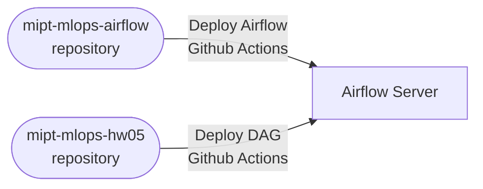
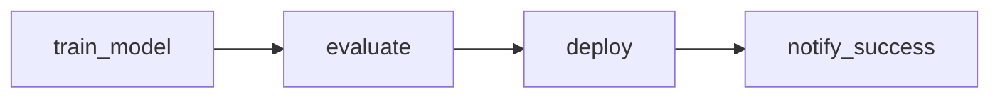

# README

ДЗ-5. Airflow

- Деплой Airflow
  - Дополнительный репозиторий: https://github.com/outlier-xxi/mipt-mlops-airflow
  - Деплой Airflow Server выполняется с помощью GitHub Actions на внешнюю ВМ: https://github.com/outlier-xxi/mipt-mlops-airflow/actions
- Деплой DAG
  - Текущий репозиторий: https://github.com/outlier-xxi/mipt-mlops-hw05
  - Деплой DAG выполняется с помощью GitHub Actions на Airflow Server: https://github.com/outlier-xxi/mipt-mlops-hw05/actions

## Архитектура

Projects:

DAG:

## Структура проекта
