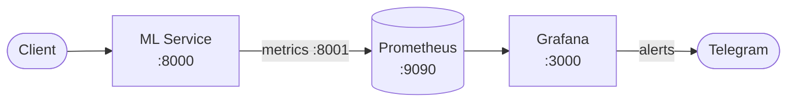

# README

ДЗ-5. Airflow

- Деплой Airflow
  - Репозиторий: https://github.com/outlier-xxi/mipt-mlops-airflow
  - GitHub Actions Deploy: https://github.com/outlier-xxi/mipt-mlops-airflow/actions

## Архитектура

## Структура проекта
